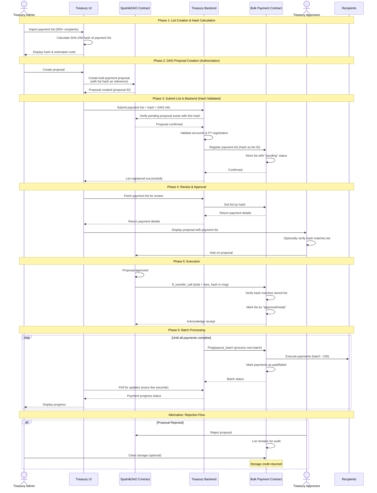

# Bulk Payment Import Architecture

This document describes the architecture for the NEAR Treasury Bulk Payment system.

## Key Security Feature: Hash-Based List Validation

The payment list ID is a SHA-256 hash of the list contents. This ensures:
- The API cannot be called with arbitrary payloads - every list must have a corresponding pending DAO proposal with a matching hash
- The stored payment list exactly matches what was proposed (integrity guarantee)
- Only authorized DAO members can trigger list storage (proper authorization)
- No auto-incrementing IDs needed - the hash is deterministic and prevents duplicates

**Hash Calculation:**
```
list_id = SHA256(canonical_json)
```
Where `canonical_json` is:
- Keys sorted alphabetically: `{"payments":[...],"submitter":"...","token_id":"..."}`
- Payment keys sorted alphabetically: `{"amount":"...","recipient":"..."}`
- Payments sorted by recipient account ID

---

## Flow Overview

1. **Treasury bulk payments UI** helps draft all transfer requests and calculates a SHA-256 hash of the payment list

2. **UI creates DAO proposal first** with the list hash as the bulk-payment reference. This requires proper DAO permissions, preventing unauthorized submissions.

3. **UI submits payment list to Treasury backend** along with the hash
   - Backend verifies the SHA-256 hash of the payload matches the provided list_id (integrity check)
   - Backend queries the DAO contract to verify a pending proposal exists with this hash
   - Backend validates accounts are valid and registered in target FT contracts
   - Backend submits the list to the bulk payment contract using the hash as the list ID
   - Only if the hash matches the payload AND a pending DAO proposal exists will the list be accepted

4. **Treasury displays** custom "bulk-payment" proposals showing the actual payment list (fetched from backend/contract using the hash)

5. **Approvers review and vote** on the proposal. They can independently verify the list by recalculating the hash.

6. **Once approved**, the DAO transfers the total amount + fees to the bulk-payment contract via `ft_transfer_call` with the list hash in the msg field

7. **If rejected**, the list stays in storage for audit purposes. A method exists to clean storage of rejected proposals (reclaiming storage credit).

8. **Batch execution**: Since >100 transfers per transaction is not possible, the backend calls a "ping" operation multiple times to process payments in batches:
   - Actual payouts executed through "ping" until the pending list is empty
   - Each payment marked as paid/failed in contract storage
   - Frontend polls backend for progress updates

---

## Bulk Payment Sequence Diagram



This sequence diagram visualizes the end-to-end flow with hash-based validation, ensuring the API cannot accept payment lists without a corresponding authorized DAO proposal.

---

## Contract Implementation

The bulk payment contract (`near-treasury-bulk-payment-contract`) implements the following:

### List ID Format

- **Type**: 64-character hexadecimal string (SHA-256 hash)
- **Validation**: Must match regex `^[0-9a-f]{64}$`
- **Generation**: Client-side SHA-256 of canonical JSON payment list

### Contract State

```rust
pub struct BulkPaymentContract {
    payment_lists: IterableMap<ListId, PaymentList>,  // ListId = String (64-char hex)
    storage_credits: IterableMap<AccountId, NearToken>,
}
```

### Payment List Structure

```rust
pub struct PaymentList {
    pub owner: AccountId,
    pub status: ListStatus,        // Pending | Approved | Rejected
    pub token_type: TokenType,     // Native | NEP141 | Intents
    pub payments: Vec<PaymentRecord>,
}

pub struct PaymentRecord {
    pub recipient: AccountId,
    pub amount: U128,
    pub payment_status: PaymentStatus,  // Pending | Paid | Failed
}
```

### Key Methods

| Method | Description |
|--------|-------------|
| `buy_storage()` | Purchase storage credits (10% markup for revenue) |
| `submit_list(list_id, ...)` | Submit payment list with client-generated hash as ID |
| `approve_list(list_id)` | Approve list via direct deposit |
| `ft_on_transfer(...)` | NEP-141 callback for approval via ft_transfer_call |
| `mt_on_transfer(...)` | NEP-245 callback for NEAR Intents approval |
| `payout_batch(list_id, count)` | Execute batch of payments |
| `retry_failed(list_id)` | Retry failed payments |
| `reject_list(list_id)` | Reject pending list |
| `view_list(list_id)` | View payment list details |

### Token Support

- **Native NEAR**: Direct transfers via `Promise::new().transfer()`
- **NEP-141 Fungible Tokens**: Via `ft_transfer` cross-contract calls
- **NEAR Intents (BTC, etc.)**: Via `mt_burn` for multi-token withdrawals

---

## Benefits of Hash-Based List IDs

1. **Prevents API abuse**: The backend cannot be called with arbitrary payloads - every list must have a corresponding pending DAO proposal with a matching hash. This prevents storage spam.

2. **Integrity guarantee**: The hash ensures the stored payment list exactly matches what was proposed. No tampering possible between proposal creation and list storage.

3. **Proper authorization**: DAO proposal creation requires proper DAO permissions, so only authorized members can trigger list storage.

4. **Deterministic list IDs**: Using the content hash as the list ID means:
   - No need for auto-incrementing IDs in the contract
   - The same list always produces the same ID
   - Duplicate lists are naturally prevented
   - Easy verification: anyone can hash the list and confirm it matches the proposal

5. **Simplified verification**: Approvers can independently verify the list contents match the proposal by recalculating the hash.
